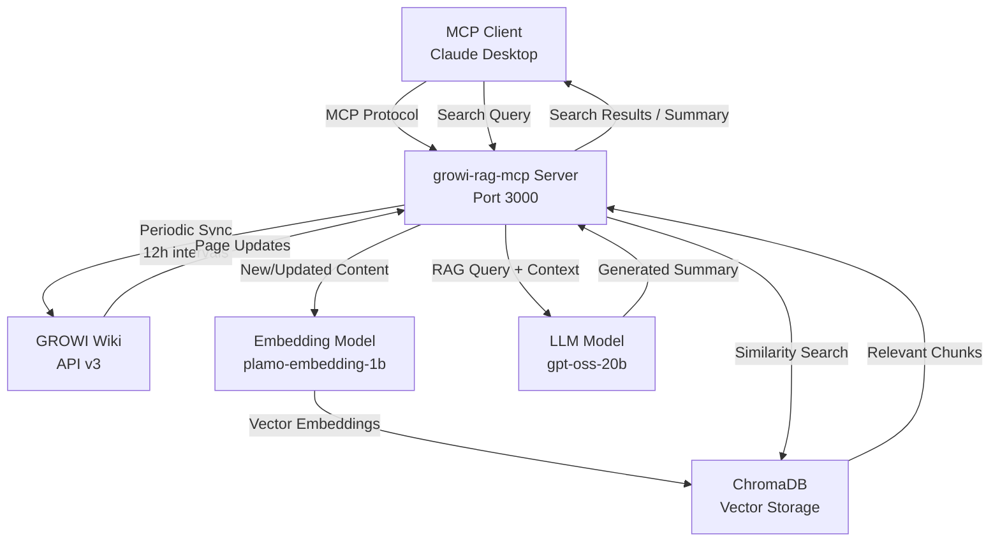

# GROWI RAG MCP Server

<div align="center">

[](https://www.python.org/downloads/)
[](https://opensource.org/licenses/MIT)
[](https://modelcontextprotocol.io)

*Retrieval Augmented Generation MCP server for GROWI wiki integration*

</div>

## 🎯 Overview

**growi-rag-mcp** は、[GROWI](https://growi.org) wiki のコンテンツを利用して RAG（Retrieval-Augmented Generation）検索機能を提供する独立した MCP サーバーです。Claude Desktop などの MCP クライアントから呼び出すことができ、GROWI の知識ベースに対してインテリジェントな検索と要約を実行できます。

### 🔑 Key Features

- **🔍 Vector Search**: GROWI ページのベクトル検索機能
- **📝 RAG Summarization**: 検索結果を基にした AI 要約生成
- **🔒 Security First**: 公開ページのみを処理、Bearer token 認証
- **⚡ High Performance**: 10秒以内のレスポンス目標
- **🐳 Docker Ready**: コンテナ化対応済み
- **🔧 MCP Protocol**: 標準的な MCP プロトコルでの通信

## 🏗️ Architecture



## 🚀 Quick Start

### Prerequisites

- **Python 3.11+**
- **uv** package manager
- **GROWI** instance with API access
- **Docker** (optional, for containerized deployment)

### Installation

1. **Clone the repository**
   ```bash
   git clone <repository-url>
   cd growi-rag-mcp
   ```

2. **Install dependencies with uv**
   ```bash
   uv sync
   ```

3. **Configure the server**
   ```bash
   cp config.yaml.sample config.yaml
   cp .env.example .env
   # Edit config.yaml and .env with your GROWI settings
   ```

4. **Set environment variables**
   ```bash
   # Option 1: Edit .env file
   nano .env

   # Option 2: Export directly
   export GROWI_API_URL="https://your-growi.example.com"
   export GROWI_API_TOKEN="your-bearer-token"
   ```

5. **Run the server**
   ```bash
   uv run python src/main.py
   ```

### Docker Deployment

#### Option 1: Docker Build & Run
```bash
# Build the image
docker build -t growi-rag-mcp .

# Run the container with environment variables
docker run -d \
  --name growi-rag-mcp \
  -p 3000:3000 \
  -v $(pwd)/config.yaml:/app/config.yaml:ro \
  -v $(pwd)/models:/app/models:ro \
  -v growi_chroma_db:/app/chroma_db \
  -e GROWI_API_URL="https://your-growi.example.com" \
  -e GROWI_API_TOKEN="your-bearer-token" \
  growi-rag-mcp
```

#### Option 2: Docker Compose (Recommended)
```bash
# Set environment variables
cp .env.example .env
nano .env  # Edit with your settings

# Start with Docker Compose
docker-compose up -d

# View logs
docker-compose logs -f

# Stop the service
docker-compose down
```

## ⚙️ Configuration

### config.yaml Structure

```yaml
growi:
  api_url: "https://your-growi.example.com"
  api_token: "${GROWI_API_TOKEN}"
  page_limit: 1000

models:
  embedding_model_path: "./models/plamo-embedding-1b"
  llm_model_path: "./models/gpt-oss-20b"

vector_db:
  persist_directory: "./data/chroma"
  collection_name: "growi_pages"

mcp:
  host: "0.0.0.0"
  port: 3000

logging:
  level: "INFO"
  format: "json"
```

### Environment Variables

| Variable | Description | Required |
|----------|-------------|----------|
| `GROWI_API_URL` | GROWI instance URL | ✅ |
| `GROWI_API_TOKEN` | Bearer token for API access | ✅ |
| `LOG_LEVEL` | Logging level (DEBUG/INFO/WARNING/ERROR) | ❌ |
| `MCP_PORT` | MCP server port (default: 3000) | ❌ |

## 🛠️ Available MCP Tools

### 1. `growi_retrieve`

ベクトル検索機能で関連するページチャンクを取得します。

**Parameters:**
- `query` (string): 検索クエリ
- `limit` (int, optional): 結果数の上限 (default: 5)
- `similarity_threshold` (float, optional): 類似度の閾値 (default: 0.7)

**Returns:**
```json
{
  "results": [
    {
      "page_id": "60f1b2a3c4d5e6f7a8b9c0d1",
      "title": "API Documentation",
      "path": "/api/overview",
      "content": "このページではAPIの概要について...",
      "similarity_score": 0.89,
      "chunk_id": "chunk_1"
    }
  ]
}
```

### 2. `growi_rag_search`

検索 + AI要約を実行し、包括的な回答を生成します。

**Parameters:**
- `query` (string): 検索クエリ
- `max_chunks` (int, optional): 使用するチャンク数 (default: 10)

**Returns:**
```json
{
  "summary": "APIに関する質問への回答として...",
  "sources": [
    {
      "page_title": "API Documentation",
      "page_path": "/api/overview",
      "relevance": 0.89
    }
  ],
  "processing_time_ms": 3240
}
```

## 🧪 Development

### Project Structure

```
growi-rag-mcp/
├── src/                       # Source code
│   ├── core/                 # Core functionality & configuration
│   │   ├── config.py        # Configuration management
│   │   ├── logging_config.py # Structured logging
│   │   └── exceptions.py     # Custom exceptions
│   ├── growi/                # GROWI API integration
│   │   ├── client.py        # GROWI API client
│   │   ├── page_filter.py   # Page filtering logic
│   │   └── sync_scheduler.py # Sync scheduling
│   ├── embedding/            # Embedding & vector storage
│   │   ├── model.py         # Embedding models
│   │   ├── pipeline.py      # Embedding pipeline
│   │   └── store.py         # Vector storage (ChromaDB)
│   ├── search/               # Search & text processing
│   │   ├── vector_search.py # Vector search engine
│   │   └── text_chunker.py  # Text chunking
│   ├── llm/                  # LLM functionality
│   │   └── summarizer.py    # LLM summarization
│   ├── monitoring/           # Health & metrics
│   │   ├── health.py        # Health checks
│   │   └── metrics.py       # Metrics collection
│   ├── mcp_handlers/         # MCP server implementation
│   │   └── tools.py         # MCP tools
│   ├── validation/           # Integration validation
│   └── main.py              # Application entry point
├── tests/                    # Test suite (182 tests)
├── docs/                     # Documentation
│   ├── spec.md              # Technical specification
│   ├── src-restructuring-plan.md # Structure plan
│   └── tasks.md             # Development tasks
├── .claude/                  # Claude Code integration
│   ├── commands/            # Custom commands
│   ├── agents/              # Agent configurations
│   └── flow/                # Development workflow
├── config.yaml              # Configuration file
├── pyproject.toml           # Python project configuration
└── Dockerfile               # Container configuration
```

### Development Workflow

このプロジェクトは **Claude Code** と **TDD (Test-Driven Development)** による開発フローを採用しています。

#### Structure Benefits
リストラクチャリング完了により以下の利点を享受：
- 📁 **機能別組織化**: 6つの明確なモジュール構造
- 🧪 **テスト安定性**: 182テスト全て成功
- 🔧 **保守性向上**: 関連コードの集約化
- 📈 **スケーラビリティ**: 新機能の配置先が明確

#### Claude Code Commands
```bash
# Check current development status
/flow-stats

# Start working on the next task
/flow-next

# Run full milestone
/flow-run --milestone M6
```

### Testing

プロジェクトには **182個の包括的なテストスイート** が含まれています。

```bash
# Run all tests (182 tests)
uv run pytest tests/ -v

# Run tests with summary
uv run pytest --tb=no -q

# Run with coverage
uv run pytest tests/ --cov=src --cov-report=html

# Run specific module tests
uv run pytest tests/test_config.py::TestConfigManager -v
uv run pytest tests/test_growi_client.py -v
uv run pytest tests/test_embedding_* -v

# Run by functionality area
uv run pytest tests/test_*config* -v      # Core configuration
uv run pytest tests/test_*growi* -v       # GROWI integration
uv run pytest tests/test_*embedding* -v   # Embedding & vectors
uv run pytest tests/test_*llm* -v         # LLM functionality
```

### Code Quality

```bash
# Format code
uv run ruff format src tests

# Lint code
uv run ruff check src tests

# Type checking
uv run mypy src
```

## 📊 Monitoring & Health Checks

The server exposes health check endpoints:

- **GET `/health`**: Basic health status, uptime, and version
- **GET `/ready`**: Readiness check (dependencies loaded)

### Health Response Example

```json
{
  "status": "healthy",
  "uptime_seconds": 3600,
  "version": "0.1.0",
  "dependencies": {
    "growi_api": "connected",
    "vector_db": "ready",
    "models": "loaded"
  },
  "last_sync": "2025-01-15T10:30:00Z",
  "indexed_pages": 856
}
```

## 🔐 Security Considerations

- **Public Pages Only**: サーバーは `grant=1` の公開ページのみを処理
- **Bearer Token**: GROWI API への認証にBearer tokenを使用
- **Local Models**: 外部API依存なし、すべてローカルで実行
- **Data Privacy**: センシティブな情報の自動検出と除外機能

## 📈 Performance

- **Response Time**: 検索+要約で10秒以内を目標
- **Throughput**: 同時接続数に応じた自動スケーリング
- **Memory Usage**: 効率的なベクトル検索とモデルロード
- **Storage**: ChromaDBによる永続化ストレージ

## 🤝 Contributing

1. **Fork** the repository
2. **Create** a feature branch: `git checkout -b feature/amazing-feature`
3. **Follow** TDD methodology: Red → Green → Refactor
4. **Test** your changes: `uv run pytest tests/ -v`
5. **Commit** with conventional format: `feat: add amazing feature (T042)`
6. **Submit** a pull request

### Development Milestones

- **M1**: ✅ Project Setup & Infrastructure
- **M2**: ✅ GROWI API Integration
- **M3**: ✅ Vector Embedding System
- **M4**: ✅ MCP Server Implementation
- **M5**: ✅ RAG Search Functionality
- **M6**: ✅ Integration & Testing Complete
- **M7**: 🔄 Production Deployment (Current)

## 📄 License

This project is licensed under the MIT License. See [LICENSE](LICENSE) file for details.

## 🙏 Acknowledgments

- [GROWI](https://growi.org) - Wiki platform
- [MCP Protocol](https://modelcontextprotocol.io) - Model Context Protocol
- [ChromaDB](https://www.trychroma.com) - Vector database
- [Transformers](https://huggingface.co/transformers) - ML models

---

<div align="center">

**Built with ❤️ using Claude Code and TDD methodology**

[Documentation](docs/) • [Issues](issues/) • [Discussions](discussions/)

</div>